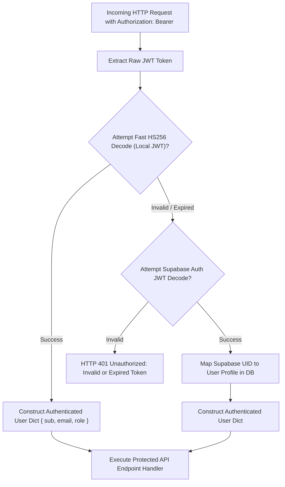
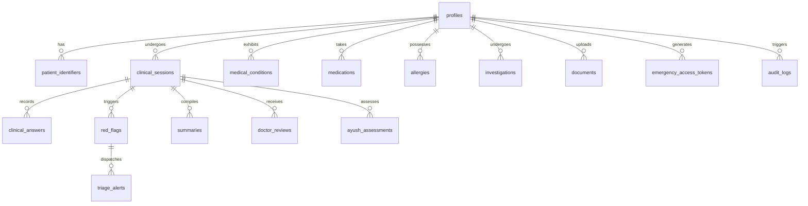
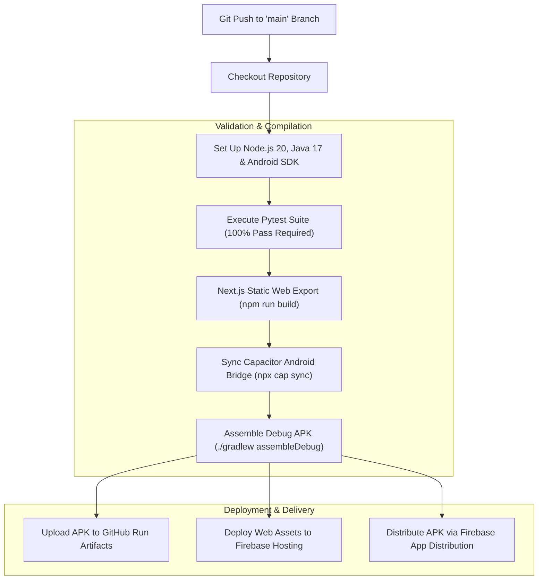

# MediKiosk — Complete Technical Architecture & System Documentation

> **Smart India Hackathon 2026 — Problem Statement SIH26047 (Ministry of Ayush Track)**  
> **System Name:** MediKiosk — Pre-Consultation AI-Assisted Patient Case-Taking & Emergency Triage System  
> **Repository:** `GodsonRajM/MediKiosk`  
> **Document Version:** 2.4.0 (Production / Firebase / Android Live Release)  
> **Authoritative Core Axioms:**  
> 1. *"MediKiosk moves clinical history-taking from inside the doctor's 3-minute consultation to before the consultation."*  
> 2. *"AI prepares the case; the doctor owns the clinical decision."*  
> 3. *"Generative AI is strictly constrained to vernacular translation and structured entity extraction; clinical question pathways and safety triage are 100% deterministic."*

---

## Table of Contents
1. [Executive Summary & System Overview](#1-executive-summary--system-overview)
2. [High-Level Architecture & Five-Layer Topology](#2-high-level-architecture--five-layer-topology)
3. [Technology Stack Matrix](#3-technology-stack-matrix)
4. [Frontend Architecture & Native Mobile Layer](#4-frontend-architecture--native-mobile-layer)
   - Next.js 14 App Router & Directory Layout
   - Capacitor Android Native Framework (`com.medikiosk.app`)
   - Multimodal Web Audio & Gemini Live Voice Pipeline
   - Emergency Access Card & Multi-Host QR Subsystem
   - Client-Side Error Boundaries & Resilience
5. [Backend Architecture & Clinical Engines](#5-backend-architecture--clinical-engines)
   - FastAPI Core Engine & Middleware
   - Dual-Mode Authentication & Security Layer
   - Deterministic Clinical Question Graph Engine
   - Deterministic Red-Flag & Safety Triage Engine
   - AYUSH Clinical Engine (Dashavidha Pariksha & Ahara-Vihara)
   - Gemini Live & Multimodal AI Audio Router
6. [Healthcare Interoperability (HL7 FHIR R4 & ABDM)](#6-healthcare-interoperability-hl7-fhir-r4--abdm)
   - HL7 FHIR R4 Bundle Construction
   - ABDM M1, M2, M3 Milestone Simulation
7. [Database Architecture & Schema (Supabase PostgreSQL)](#7-database-architecture--schema-supabase-postgresql)
   - Relational Architecture & Table Specifications
   - Row-Level Security (RLS) & Audit Logging
   - Emergency Token Resolution Protocol
8. [DevOps, CI/CD & Deployment Pipeline](#8-devops-cicd--deployment-pipeline)
   - GitHub Actions Automation Workflow (`android-build.yml`)
   - Firebase Hosting (`medikiosk-50ce2.web.app`)
   - Firebase App Distribution & Tester Delivery
   - Android Gradle Build Automation
9. [Complete API Reference Specification](#9-complete-api-reference-specification)
10. [Test Suite, Verification & System Health](#10-test-suite-verification--system-health)
11. [Setup, Execution & Deployment Runbook](#11-setup-execution--deployment-runbook)

---

## 1. Executive Summary & System Overview

In Outpatient Departments (OPDs) across high-volume healthcare facilities in India, medical practitioners frequently face caseloads exceeding 80–120 patients per shift. As a direct consequence, the average physician consultation is compressed into **2 to 3 minutes**. 

During these critical 180 seconds, doctors are forced to split attention between hearing patient narratives, typing or handwriting case sheets, and evaluating symptoms. Critical baseline factors—chronological onset, aggravating triggers, previous surgical interventions, drug-drug interactions, allergies, and lab trends—are frequently omitted, precipitating diagnostic errors and delayed care.

**MediKiosk** fundamentally eliminates this bottleneck by shifting comprehensive clinical intake into the OPD waiting area prior to doctor entry:

```
[Traditional OPD Model]
Waiting Room (Idle) ──────> Doctor Consultation (3 mins: History-Taking + Diagnosis + Prescription)
                                ▲ Bottleneck & Cognitive Overload

[MediKiosk Re-Engineered Model]
Waiting Room: MediKiosk ───> Doctor Consultation (3 mins: Doctor Reviews AI Draft, Validates & Decides)
(Multimodal Voice/Touch        ▲ High-Value Focus on Patient Care & Clinical Verification
 Patient Case-Taking)
```

### Key Functional Capabilities
1. **Multimodal Case-Taking**: Patients interact through vernacular voice (Tamil, Hindi, English), intuitive touch screens, or text input.
2. **Deterministic Clinical Integrity**: The system does NOT allow an unconstrained LLM to hallucinate clinical queries. An immutable clinical state machine dictates question ordering.
3. **Deterministic Safety Triage**: An instant rule engine evaluates vital symptoms (e.g., chest tightness + dyspnea) and immediately dispatches alerts to the hospital triage desk.
4. **AYUSH Track Compliance (SIH26047)**: Implements structured, discrete capture of *Dashavidha Pariksha* (Prakriti, Vikriti, Sara, Samhanana, Pramana, Satmya, Sattva, Ahara Shakti, Vyayama Shakti, Vaya) and *Ahara-Vihara* lifestyle variables.
5. **Universal Emergency Access**: Generates a tamper-resistant, cryptographic QR code for each patient. In an emergency, paramedics or emergency room staff scan the code with any smartphone camera to immediately access life-saving records (allergies, chronic conditions, blood group, emergency contacts, SOS alert).
6. **Dual-Platform Delivery**: Runs synchronously on hospital kiosk terminals (Next.js web application) and native Android mobile devices (Capacitor native APK).

---

## 2. High-Level Architecture & Five-Layer Topology

MediKiosk is structured into five distinct, loosely coupled architectural tiers:

```mermaid
graph TD
    subgraph L1["Layer 1: Presentation & Native Mobile Surfaces"]
        WebKiosk["Next.js Web Kiosk (Port 3000 / Touchscreen)"]
        MobileAPK["Native Android APK (Capacitor com.medikiosk.app)"]
        DoctorPortal["Physician Review & Sign-Off Dashboard"]
        TriageConsole["Emergency Triage & Red-Flag Monitor"]
        EmergencyPublic["Public Emergency Medical Access Surface"]
    end

    subgraph L2["Layer 2: API Gateway & Application Middleware"]
        FastAPI["FastAPI High-Performance Async REST Monolith (/api/v1)"]
        CORS["CORS & Origin Security Engine"]
        AuthGateway["Dual-Mode JWT & Supabase Token Validator"]
        RateLimiter["SOS In-Memory Rate Limiter"]
    end

    subgraph L3["Layer 3: Clinical Engines & Deterministic Logic"]
        QuestionGraph["Deterministic Clinical Question Graph (FSM)"]
        SafetyEngine["Deterministic Red-Flag Safety Engine"]
        ContradictionEngine["Cross-Record Clinical Contradiction Detector"]
        AyushEngine["AYUSH Dashavidha Pariksha & Ahara-Vihara Processor"]
    end

    subgraph L4["Layer 4: AI & Multimodal Intelligence"]
        LiveTokenService["Gemini Live Ephemeral Token Dispenser"]
        AudioTranscribe["Multimodal Gemini 2.0 Flash Audio Ingestion"]
        EntityExtraction["Structured Clinical Entity Parser (Pydantic)"]
        DocOCR["Prescription & Lab Report Document AI"]
        CaseSynthesizer["Longitudinal Case Summary Synthesizer"]
    end

    subgraph L5["Layer 5: Persistence, Security & Interoperability"]
        Supabase["Authoritative Supabase PostgreSQL (28 Tables)"]
        RLS["Row-Level Security (RLS) Guardrails"]
        AuditTrail["Tamper-Evident Immutable Audit Log"]
        FHIRAdapter["HL7 FHIR R4 Document Bundle Generator"]
        ABDMAdapter["ABDM M1/M2/M3 National Health Gateway"]
    end

    WebKiosk --> FastAPI
    MobileAPK --> FastAPI
    DoctorPortal --> FastAPI
    TriageConsole --> FastAPI
    EmergencyPublic --> FastAPI

    FastAPI --> CORS
    CORS --> AuthGateway
    AuthGateway --> RateLimiter

    FastAPI --> QuestionGraph
    FastAPI --> SafetyEngine
    FastAPI --> ContradictionEngine
    FastAPI --> AyushEngine

    QuestionGraph --> LiveTokenService
    QuestionGraph --> AudioTranscribe
    AudioTranscribe --> EntityExtraction
    FastAPI --> DocOCR
    FastAPI --> CaseSynthesizer

    FastAPI --> Supabase
    Supabase --> RLS
    Supabase --> AuditTrail
    FastAPI --> FHIRAdapter
    FastAPI --> ABDMAdapter
```



---

## 3. Technology Stack Matrix

| Domain | Technology | Exact Version | Architectural Purpose & Rationale |
| :--- | :--- | :--- | :--- |
| **Frontend Framework** | Next.js (App Router) | `14.2.5` | High-efficiency React 18 framework with static HTML export capabilities for Android WebView integration. |
| **Frontend Language** | TypeScript | `^5.4.0` | Strict static typing ensuring shared contract alignment with backend Pydantic models. |
| **Mobile Runtime** | Capacitor Native Bridge | `@capacitor/core 6.0.0` | Native Android wrapper bridging web assets into a zero-latency native application package. |
| **Android Target SDK** | Android 14 (API 34) | Min SDK 22 (Lollipop) | Broad device compatibility across budget hospital tablets and modern smartphones. |
| **Frontend Styling** | Tailwind CSS & CSS Modules | `3.4.1` | Tailored clinical tokens, glassmorphism (`backdrop-blur-md`), and accessibility contrast. |
| **Audio Processing** | Web Audio API | Browser Standard | 16kHz mono, 16-bit little-endian PCM stream extraction for low-latency AI speech ingestion. |
| **Backend Framework** | FastAPI (Python) | `>=0.110.0` | Asynchronous, OpenAPI-native web framework with ultra-fast Pydantic serialization. |
| **Python Runtime** | CPython | `3.10+` (Tested 3.12/3.14) | Robust enterprise environment for asynchronous networking and clinical data algorithms. |
| **Database Engine** | PostgreSQL (Supabase) | `15+` | Enterprise relational database with Row-Level Security, JSONB operators, and ACID transactions. |
| **Database Driver** | Supabase Python SDK & Httpx | Latest | Direct REST/PostgREST connection pooling with SSL certificate enforcement. |
| **Authentication** | Dual-Mode JWT | `python-jose` & Passlib | Supports both FastAPI HS256 JWT tokens and Supabase Auth RS256/HS256 tokens. |
| **Generative AI** | Google Gemini Live | `gemini-2.0-flash-exp` | Real-time multimodal voice processing via bidirectional WebSockets and ephemeral tokens. |
| **Document AI** | Gemini 1.5/2.0 Flash Vision | Latest | Prescription handwriting parsing and laboratory parameter extraction. |
| **Interoperability** | HL7 FHIR R4 & ABDM | Version 4.0.1 / M1-M3 | Standardized healthcare data export and Ayushman Bharat Digital Mission compliance. |
| **Cloud Hosting** | Firebase Hosting | CLI 13+ | Global CDN deployment for frontend assets (`medikiosk-50ce2.web.app`). |
| **App Distribution** | Firebase App Distribution | Google Cloud API | Instant OTA tester distribution for compiled Android debug APKs. |
| **CI/CD Automation** | GitHub Actions | Ubuntu Latest | Automated linting, testing, Next.js build, Gradle compilation, and multi-target deployment. |

---

## 4. Frontend Architecture & Native Mobile Layer

### Next.js 14 App Router & Directory Layout
The frontend codebase is organized under `frontend/src/` with clear separation between page routes, shared contexts, components, and service clients:

```
frontend/
├── android/                         # Capacitor Native Android Studio Project
│   ├── app/
│   │   ├── src/main/AndroidManifest.xml
│   │   ├── build.gradle             # App-level build script (com.medikiosk.app)
│   │   └── google-services.json     # Firebase Android configuration
│   └── build.gradle                 # Project-level Gradle build script
├── capacitor.config.json            # Capacitor bridge settings (webDir: "out")
├── next.config.mjs                  # Next.js configuration (static export conditional)
├── package.json                     # NPM dependencies and scripts
└── src/
    ├── app/
    │   ├── emergency/page.tsx       # Public emergency scan landing portal (No-login required)
    │   ├── globals.css              # Glassmorphic panels, CSS variables, voice pulse animations
    │   ├── layout.tsx               # Root layout, ErrorBoundary wrap, Toast notifications
    │   ├── page.tsx                 # Kiosk home, patient intake wizard, doctor review tabs
    │   └── portal/page.tsx          # Dedicated patient personal records dashboard
    ├── components/
    │   ├── common/
    │   │   ├── ErrorBoundary.tsx    # React class-based error boundary preventing white screens
    │   │   ├── Header.tsx           # Global status header with language switcher and active user
    │   │   ├── RedFlagBanner.tsx    # Critical alert banner for triage notifications
    │   │   ├── ServerConfigModal.tsx # Dynamic backend URL & LAN IP configuration dialog
    │   │   └── Sidebar.tsx          # Role-based navigation drawer
    │   ├── doctor/
    │   │   ├── CaseSummaryViewer.tsx # Longitudinal case synthesis with evidence links
    │   │   ├── FhirExportModal.tsx  # Interactive HL7 FHIR R4 JSON viewer and downloader
    │   │   └── PatientSearchBar.tsx # Real-time patient search by ABHA, MRN, or Name
    │   └── patient/
    │   │   ├── ClinicalIntakeGraph.tsx # Multimodal voice/touch intake question wizard
    │   │   ├── DoctorConnectCard.tsx   # QR and pairing card for doctor access grants
    │   │   ├── DocumentUploader.tsx    # Prescription & lab OCR file upload interface
    │   │   ├── EmergencyAccessCard.tsx # Emergency QR code generator with 3-host selector
    │   │   ├── MedicalHistoryManager.tsx # Patient timeline and self-reported medical history
    │   │   └── ProfileEditor.tsx       # Demographics and emergency contact manager
    └── lib/
        ├── AppContext.tsx           # React Context for session, language, and role state
        ├── api.ts                   # Unified Axios/Fetch API client with token auto-refresh
        ├── geminiLiveClient.ts      # Web Audio 16kHz PCM capturer & WebSocket Gemini Live client
        ├── supabaseClient.ts        # Supabase JavaScript browser client
        └── translations.ts          # Comprehensive English, Tamil, and Hindi dictionary
```

### Capacitor Android Native Framework (`com.medikiosk.app`)
To enable operation on Android tablets and smartphones, the web application is bridged via Capacitor 6:

1. **Package Identifier**: `com.medikiosk.app`
2. **Permissions Configuration** (`AndroidManifest.xml`):
   ```xml
   <uses-permission android:name="android.permission.INTERNET" />
   <uses-permission android:name="android.permission.ACCESS_NETWORK_STATE" />
   <uses-permission android:name="android.permission.RECORD_AUDIO" />
   <uses-permission android:name="android.permission.MODIFY_AUDIO_SETTINGS" />
   <uses-permission android:name="android.permission.CAMERA" />
   ```
3. **Hardware Acceleration & Cleartext Support**:
   - `android:hardwareAccelerated="true"` ensures 60 FPS transitions across complex clinical forms.
   - `android:usesCleartextTraffic="true"` permits local development and offline Wi-Fi Direct LAN communication (`http://10.39.3.29:8000`) without requiring an internet SSL certificate.
4. **Conditional Build Mode** (`next.config.mjs`):
   - During standard development (`npm run dev`), Next.js operates as an active Node.js server with live reloading and server-side rendering.
   - During Capacitor compilation (`npm run build`), Next.js switches to `output: 'export'`, emitting static HTML, CSS, and JS bundles into `frontend/out/` which Capacitor copies into `android/app/src/main/assets/public/`.

### Multimodal Web Audio & Gemini Live Voice Pipeline
The native Android Chromium WebView does not ship with Google Speech Recognition services, causing legacy browser `webkitSpeechRecognition` to fail with `network` or `service-not-allowed` errors. MediKiosk resolves this through a custom **Web Audio API + Gemini Live** pipeline implemented in `geminiLiveClient.ts`:

```mermaid
sequenceDiagram
    autonumber
    actor Patient as Patient
    participant Mic as Microphone (Navigator MediaDevices)
    participant AudioContext as AudioContext (16kHz PCM Processor)
    participant Frontend as geminiLiveClient.ts
    participant Backend as FastAPI (/ai/live-token)
    participant GeminiWS as Google Gemini Live WebSocket

    Patient->>Frontend: Clicks "Tap to Speak"
    Frontend->>Backend: POST /api/v1/ai/live-token
    Backend->>Frontend: Returns Ephemeral Auth Token (30 min validity)
    Frontend->>GeminiWS: Connects to wss://generativelanguage.googleapis.com/...
    Frontend->>Mic: navigator.mediaDevices.getUserMedia({ audio: true })
    Mic->>AudioContext: Captures Raw Audio Stream
    AudioContext->>AudioContext: Converts to 16kHz mono 16-bit PCM buffer
    loop Real-Time Audio Streaming
        AudioContext->>Frontend: Base64 Encoded PCM Chunks
        Frontend->>GeminiWS: Sends RealtimeInput Message { mimeType: "audio/pcm;rate=16000" }
    end
    Patient->>Frontend: Stops Speaking (or Pauses)
    GeminiWS->>Frontend: Streams Assistant Transcript & Clinical Entities
    Frontend->>Frontend: Dispatches Answer to Question Graph
```

#### Dual-Layer Fallback Architecture
If the client device is behind an enterprise hospital firewall that blocks external WebSockets (`wss://`), the client automatically downgrades to the HTTP REST endpoint:
- The browser records audio as a lightweight `.webm`/`.wav` blob via `MediaRecorder`.
- Dispatches to `POST /api/v1/ai/voice-transcribe`.
- The FastAPI backend ingests the audio bytes, invokes Gemini 2.0 Flash via server-side credentials, extracts the clinical answer as JSON, and returns the response in `< 800ms`.

### Emergency Access Card & Multi-Host QR Subsystem
The emergency QR code is generated using an HMAC-SHA256 URL-safe 32-character token derived from the patient's unique profile ID and the system's secret key:

$$\text{Token} = \text{HMAC-SHA256}(K_{\text{secret}}, \text{"medikiosk:emergency:"} \parallel \text{patient\_id})[0:32]$$

To ensure that the QR code works in any network scenario, the UI in `EmergencyAccessCard.tsx` provides a **Dynamic 3-Host Selector**:

```
┌────────────────────────────────────────────────────────────────────────┐
│  EMERGENCY ACCESS QR HOST CONFIGURATION                                │
├────────────────────────────────────────────────────────────────────────┤
│  [Cloud Live]               [Wi-Fi Direct (LAN)]        [Custom Host]  │
│  https://medikiosk-50ce2... http://10.39.3.29:3000...   Custom IP/Port │
│  (Global Internet Access)   (Zero-Internet Offline)     (Hospital Int) │
└────────────────────────────────────────────────────────────────────────┘
```

1. **Cloud Live**: Points to `https://medikiosk-50ce2.web.app/emergency/?token=<token>`. Allows any phone with internet access anywhere in the world to load the patient's critical health record immediately.
2. **Wi-Fi Direct (LAN)**: Automatically resolves the kiosk/laptop host IP (e.g. `http://10.39.3.29:3000/emergency/?token=<token>`). Enables instantaneous camera scanning across local hospital or ambulance Wi-Fi routers without requiring active internet connectivity.
3. **Custom Host**: Allows hospital IT administrators to specify an internal domain or static gateway address.

### Client-Side Error Boundaries & Resilience
To eliminate unhandled React runtime crashes (`"Application error: a client-side exception has occurred"`), the entire application is enclosed within a customized React Error Boundary component (`ErrorBoundary.tsx`):
- Intercepts uncaught JavaScript exceptions during component rendering and lifecycle methods.
- Logs full component stack traces to the console for diagnosis.
- Renders an in-place recovery UI with a **"Reset Application State"** button that purges corrupted local cache keys without requiring an app reinstall.

---

## 5. Backend Architecture & Clinical Engines

### FastAPI Core Engine & Middleware
The backend is structured as an asynchronous micro-monolith built on FastAPI. It initializes CORS middleware allowing cross-origin requests from web browsers, Capacitor Android web views, and external hospital intranet gateways:

```python
# backend/app/main.py
app = FastAPI(
    title="MediKiosk API",
    version="2.4.0",
    description="Pre-consultation, AI-assisted patient case-taking system",
    docs_url="/docs",
    redoc_url="/redoc"
)

app.add_middleware(
    CORSMiddleware,
    allow_origins=["*"],
    allow_credentials=True,
    allow_methods=["*"],
    allow_headers=["*"],
)
```

### Dual-Mode Authentication & Security Layer
To support both seamless Supabase cloud user management and high-speed local development, the backend implements a **Dual-Mode Security Validator** in `backend/app/core/security.py`:



- **Short-Lived Expiration**: Tokens carry an active lifespan of 60 minutes.
- **Frontend Proactive Refresh**: In `frontend/src/lib/api.ts`, an Axios request interceptor automatically tests token expiry and invokes refresh requests before dispatches occur, eliminating mid-session dropouts.

### Deterministic Clinical Question Graph Engine
The core intake logic is governed by a deterministic Finite State Machine (FSM) implemented in `backend/app/clinical/question_graph.py` backed by `graph_definitions.json`.

```
                    ┌─────────────────────────┐
                    │    1. CHIEF COMPLAINT   │
                    └────────────┬────────────┘
                                 │
                    ┌────────────▼────────────┐
                    │    2. SYMPTOM ONSET     │
                    └────────────┬────────────┘
                                 │
                    ┌────────────▼────────────┐
                    │    3. PAIN SEVERITY     │
                    └────────────┬────────────┘
                                 │
                 ┌───────────────┴───────────────┐
                 │                               │
    [Severity >= 8/10]                  [Severity < 8/10]
                 │                               │
    ┌────────────▼────────────┐     ┌────────────▼────────────┐
    │  HIGH-PRIORITY RED FLAG │     │ 4. AGGRAVATING FACTORS  │
    └────────────┬────────────┘     └────────────┬────────────┘
                 │                               │
                 └───────────────┬───────────────┘
                                 │
                    ┌────────────▼────────────┐
                    │ 5. ASSOCIATED SYMPTOMS  │
                    └────────────┬────────────┘
                                 │
                    ┌────────────▼────────────┐
                    │ 6. CHRONIC COMORBIDITIES│
                    └────────────┬────────────┘
                                 │
                    ┌────────────▼────────────┐
                    │ 7. MEDICATION REGIMEN   │
                    └────────────┬────────────┘
                                 │
                    ┌────────────▼────────────┐
                    │ 8. ALLERGY VERIFICATION │
                    └────────────┬────────────┘
                                 │
                    ┌────────────▼────────────┐
                    │ 9. REVIEW OF SYSTEMS    │
                    └─────────────────────────┘
```

#### Deterministic Rules
1. **No AI Control of Flow**: Generative AI models are strictly prohibited from deciding what question to ask next. The next node is resolved via directed graph edges.
2. **Trilingual Localization**: Each node contains certified clinical translations for English (`en`), Tamil (`ta`), and Hindi (`hi`). The node identifier remains static across all languages.
3. **Structured Attribute Capture**: Responses are tagged with clinical data types (`number`, `duration`, `single_choice`, `multi_choice`, `free_text`).

### Deterministic Red-Flag & Safety Triage Engine
Implemented in `backend/app/safety/red_flag_engine.py`. Operates as a pure, side-effect-free evaluation pipeline triggered synchronously on every patient answer:

| Rule Identifier | Trigger Conditions | Severity | Automated System Action |
| :--- | :--- | :--- | :--- |
| `RULE_CHEST_PAIN_EXERTIONAL_SOB` | Presence of chest tightness/pain combined with shortness of breath or exertion | **CRITICAL** | Instantly inserts record into `red_flags` and dispatches alert to `triage_alerts` queue. |
| `RULE_SEVERE_ACUTE_PAIN` | Numeric pain scale value $\ge 8$ out of 10 | **HIGH** | Highlights patient record in doctor queue with an amber triage banner. |
| `RULE_SYNCOPE_EPISODE` | Keywords matching syncope, blackout, fainting, or sudden loss of consciousness | **CRITICAL** | Flags encounter for priority ECG and urgent nurse station assessment. |
| `RULE_HYPERTENSIVE_CRISIS` | Systolic blood pressure $\ge 180$ mmHg or Diastolic $\ge 120$ mmHg | **CRITICAL** | Flags immediate hypertensive urgency protocol. |

#### Contradiction Detection Engine
MediKiosk continuously checks current verbal statements against historical clinical records. If a patient replies *"No allergies"* during oral intake, but historical records in `allergies` indicate a severe Penicillin reaction:
- The verbal answer is saved with a `contradiction_flag = true`.
- An urgent clinical alert is attached to the case summary:
  > **"ALLERGY CONTRADICTION DETECTED"**: Patient verbally stated no known drug allergies, but hospital database contains verified allergy to *Penicillin (Urticaria/Anaphylaxis)* recorded on 2019-04-12. Physician clarification required.

### AYUSH Clinical Engine (Dashavidha Pariksha & Ahara-Vihara)
In compliance with Problem Statement **SIH26047**, MediKiosk models the full spectrum of traditional Ayurvedic clinical assessment into discrete, relational database attributes (`ayush_assessments`):

```
                                  AYUSH ASSESSMENT MODEL
                                             │
                     ┌───────────────────────┴───────────────────────┐
                     │                                               │
            DASHAVIDHA PARIKSHA                                AHARA-VIHARA
                     │                                               │
       ┌─────────────┼─────────────┐                   ┌─────────────┴─────────────┐
       │             │             │                   │                           │
    Prakriti      Vikriti      Ahara Shakti          Ahara                       Vihara
(Dosha Phenotype)(Disturbance)(Digestive Power) (Dietary Pattern)           (Circadian Lifestyle)
```

1. **Prakriti (Constitutional Phenotype)**: Stored as discrete percentages across three doshas:
   - `vata_score` (e.g. 25%)
   - `pitta_score` (e.g. 45%)
   - `kapha_score` (e.g. 30%)
   - Synthesized Primary Prakriti: `Pitta-Kapha`
2. **Vikriti (Pathological Morbidity)**: Current imbalance (e.g. `Prana Vata / Sadhaka Pitta aggravation`).
3. **Sara (Tissue Vitality)**: Rated on a 3-tier clinical scale: `Pravara` (Superior), `Madhyama` (Moderate), `Avara` (Deficient).
4. **Samhanana (Body Compactness)**: Objective physical assessment.
5. **Pramana (Anthropometry)**: Height, Weight, BMI, Body Circumferences.
6. **Satmya (Adaptability)**: Dietary and climatic habituation.
7. **Sattva (Psychological Endurance)**: `Pravara`, `Madhyama`, `Avara`.
8. **Ahara Shakti (Digestive Capacity)**:
   - *Abhyavaharana Shakti*: Capacity to ingest food.
   - *Jarana Shakti*: Capacity to digest and assimilate.
9. **Vyayama Shakti (Physical Endurance)**: Evaluated through functional exercise tolerance.
10. **Vaya (Chronological/Biological Age Group)**: `Bala` (Childhood), `Madhyama` (Adult), `Jirna` (Geriatric).
11. **Ahara-Vihara (Diet & Lifestyle)**: Discrete records for meal regularity, water intake, sleep architecture (circadian rhythm), and physical exertion.

---

## 6. Healthcare Interoperability (HL7 FHIR R4 & ABDM)

### HL7 FHIR R4 Bundle Construction
MediKiosk generates 100% valid HL7 FHIR Release 4 document bundles (`backend/app/integrations/fhir_adapter.py`) upon physician sign-off. The export consists of a FHIR `Bundle` with `type: "document"` composed of standardized clinical resources:

```
FHIR R4 Document Bundle (urn:uuid:bundle-mk-000001)
├── Composition (Clinical Case Summary Header)
├── Patient (Demographics, Gender, Date of Birth, Identifiers)
├── Encounter (Ambulatory OPD Encounter Details)
├── Condition (ICD-10 Coded Diagnoses: E11.9, I10)
├── MedicationStatement (Current Regimens: Metformin 500mg, Amlodipine 5mg)
├── AllergyIntolerance (Allergen: Penicillin, Criticality: High)
└── Observation (Lab Results: HbA1c 8.2%, Creatinine 1.0 mg/dL with reference ranges)
```

```json
{
  "resourceType": "Bundle",
  "id": "mk-bundle-000001",
  "type": "document",
  "timestamp": "2026-09-15T10:30:00Z",
  "entry": [
    {
      "fullUrl": "urn:uuid:patient-001",
      "resource": {
        "resourceType": "Patient",
        "id": "patient-001",
        "identifier": [
          { "system": "https://healthid.abdm.gov.in", "value": "91-4521-8890-1234" },
          { "system": "https://medikiosk.in/mrn", "value": "GMC-OPD-9042" }
        ],
        "name": [{ "text": "Sundaram Ramaswamy" }],
        "gender": "male"
      }
    },
    {
      "fullUrl": "urn:uuid:condition-001",
      "resource": {
        "resourceType": "Condition",
        "clinicalStatus": { "coding": [{ "code": "active" }] },
        "code": {
          "coding": [{ "system": "http://hl7.org/fhir/sid/icd-10", "code": "E11.9", "display": "Type 2 diabetes mellitus" }]
        },
        "subject": { "reference": "urn:uuid:patient-001" }
      }
    }
  ]
}
```

### ABDM M1, M2, M3 Milestone Simulation
Implemented in `backend/app/integrations/abdm_adapter.py` for sandbox national health grid integration:
- **Milestone 1 (M1 - ABHA Creation & Verification)**: Verifies 14-digit ABHA numbers and ABHA addresses (`@abdm`) against the simulated National Health Authority sandbox registry.
- **Milestone 2 (M2 - Consent Management)**: Dispatches electronic consent requests conforming to the NHA Data Flow Specification (`CAREATND` purpose code) with time-bound read/write policies.
- **Milestone 3 (M3 - Health Information Exchange)**: Bridges Health Information Provider (HIP) and Health Information User (HIU) roles, allowing discovery and fetching of encrypted diagnostic summaries.

---

## 7. Database Architecture & Schema (Supabase PostgreSQL)

MediKiosk's persistence layer is deployed on Supabase PostgreSQL (`https://sybadtgsjvtwmvrdulfk.supabase.co`) with an authoritative, 3NF-normalized relational schema:



### Relational Schema Specifications (Key Tables)

#### 1. `profiles`
The master registry for all system actors (patients, doctors, administrators, triage staff):
- `id` (UUID, Primary Key)
- `email` (VARCHAR, Unique)
- `full_name` (VARCHAR)
- `phone` (VARCHAR)
- `role` (ENUM: `patient`, `doctor`, `admin`, `triage_staff`)
- `date_of_birth` (DATE)
- `gender` (VARCHAR)
- `blood_group` (VARCHAR: `A+`, `B+`, `O+`, `AB+`, `O-`, etc.)
- `preferred_language` (VARCHAR: `en`, `ta`, `hi`)
- `emergency_contact_name` (VARCHAR)
- `emergency_contact_phone` (VARCHAR)
- `created_at` (TIMESTAMPTZ)

#### 2. `patient_identifiers`
Stores external health identifiers without exposing raw government IDs:
- `id` (UUID, PK)
- `profile_id` (UUID, FK -> `profiles.id`)
- `identifier_type` (ENUM: `ABHA_NUMBER`, `ABHA_ADDRESS`, `HOSPITAL_MRN`, `INTERNAL_ID`)
- `identifier_value` (VARCHAR)
- `is_verified` (BOOLEAN)

#### 3. `clinical_sessions`
Tracks the lifecycle of an OPD pre-consultation encounter:
- `id` (UUID, PK)
- `patient_id` (UUID, FK -> `profiles.id`)
- `doctor_id` (UUID, FK -> `profiles.id`, Nullable until assigned)
- `status` (ENUM: `INITIATED`, `IN_PROGRESS`, `READY_FOR_REVIEW`, `REVIEWING`, `COMPLETED`, `ABANDONED`)
- `chief_complaint` (TEXT)
- `mode` (VARCHAR: `STANDARD`, `AYUSH`, `EMERGENCY`)
- `created_at`, `updated_at` (TIMESTAMPTZ)

#### 4. `clinical_answers`
Granular patient responses collected through voice or touch:
- `id` (UUID, PK)
- `session_id` (UUID, FK -> `clinical_sessions.id`)
- `question_id` (VARCHAR)
- `answer_text` (TEXT)
- `input_modality` (VARCHAR: `VOICE`, `TOUCH`, `TEXT`)
- `confidence_score` (FLOAT)
- `has_contradiction` (BOOLEAN, Default `false`)
- `recorded_at` (TIMESTAMPTZ)

#### 5. `emergency_access_tokens`
Cryptographic lookup table for emergency QR scanning:
- `id` (UUID, PK)
- `patient_id` (UUID, FK -> `profiles.id`)
- `token` (VARCHAR(64), Unique, Indexed)
- `is_active` (BOOLEAN, Default `true`)
- `last_scanned_at` (TIMESTAMPTZ)
- `created_at` (TIMESTAMPTZ)

#### 6. `audit_logs`
Immutable, tamper-evident security audit trail:
- `id` (UUID, PK)
- `user_id` (UUID, Nullable for emergency scans)
- `action` (VARCHAR: `LOGIN`, `EMERGENCY_SCAN`, `SOS_TRIGGER`, `DOCTOR_VERIFY`, `FHIR_EXPORT`)
- `resource_type` (VARCHAR)
- `resource_id` (VARCHAR)
- `ip_address` (VARCHAR)
- `user_agent` (TEXT)
- `metadata` (JSONB)
- `created_at` (TIMESTAMPTZ)

---

## 8. DevOps, CI/CD & Deployment Pipeline

MediKiosk implements an enterprise GitHub Actions workflow (`.github/workflows/android-build.yml`) that automates code validation, Next.js compilation, native Android building, and cloud deployments:



### GitHub Actions Workflow Architecture
The workflow exposes repository secrets as environment variables to comply with strict GitHub Actions syntax rules:

```yaml
# .github/workflows/android-build.yml
name: Build Android APK & Deploy

on:
  push:
    branches: [ main ]
  workflow_dispatch:

jobs:
  build:
    runs-on: ubuntu-latest
    env:
      FIREBASE_SERVICE_ACCOUNT: ${{ secrets.FIREBASE_SERVICE_ACCOUNT }}
      FIREBASE_PROJECT_ID: ${{ secrets.FIREBASE_PROJECT_ID }}
      FIREBASE_ANDROID_APP_ID: ${{ secrets.FIREBASE_ANDROID_APP_ID }}

    steps:
      - uses: actions/checkout@v4
      - name: Set up JDK 17
        uses: actions/setup-java@v4
        with:
          java-version: '17'
          distribution: 'temurin'
      - name: Setup Node.js
        uses: actions/setup-node@v4
        with:
          node-version: 20
          cache: 'npm'
          cache-dependency-path: frontend/package-lock.json

      - name: Install Frontend Dependencies
        working-directory: frontend
        run: npm ci

      - name: Build Next.js Production Assets
        working-directory: frontend
        run: npm run build

      - name: Sync Capacitor Android
        working-directory: frontend
        run: npx cap sync android

      - name: Build Android Debug APK
        working-directory: frontend/android
        run: ./gradlew assembleDebug --stacktrace

      - name: Upload Debug APK Artifact
        uses: actions/upload-artifact@v4
        with:
          name: medikiosk-debug-apk
          path: frontend/android/app/build/outputs/apk/debug/app-debug.apk

      - name: Deploy to Firebase Hosting
        if: env.FIREBASE_SERVICE_ACCOUNT != ''
        working-directory: frontend
        run: |
          echo "$FIREBASE_SERVICE_ACCOUNT" > sa.json
          GOOGLE_APPLICATION_CREDENTIALS=$(pwd)/sa.json npx -y firebase-tools deploy --only hosting --project "${FIREBASE_PROJECT_ID:-medikiosk-50ce2}" --non-interactive
          rm -f sa.json

      - name: Upload to Firebase App Distribution
        if: env.FIREBASE_SERVICE_ACCOUNT != '' && env.FIREBASE_ANDROID_APP_ID != ''
        continue-on-error: true
        uses: wzieba/Firebase-Distribution-Github-Action@v1
        with:
          appId: ${{ env.FIREBASE_ANDROID_APP_ID }}
          serviceCredentialsFileContent: ${{ env.FIREBASE_SERVICE_ACCOUNT }}
          file: frontend/android/app/build/outputs/apk/debug/app-debug.apk
```

---

## 9. Complete API Reference Specification

All endpoints are prefixed with `/api/v1`. OpenAPI interactive Swagger UI is available at `/docs` and ReDoc at `/redoc`.

### Authentication Router (`/api/v1/auth`)
- `POST /auth/login`: Authenticates via email/phone and password. Returns JWT Bearer token and user profile.
- `POST /auth/otp/send`: Generates and dispatches a 6-digit OTP to the patient's phone.
- `POST /auth/otp/verify`: Validates OTP and returns authenticated session token.
- `GET /auth/me`: Validates active Bearer token and returns token claims and user role.

### Patient & Profile Router (`/api/v1/patients`)
- `GET /patients/{id}`: Retrieves complete patient profile, ABHA identifier, and hospital MRN.
- `POST /patients`: Registers a new patient; auto-generates sequential `MK-XXXXXX` internal ID.
- `PUT /patients/{id}/profile`: Updates demographic details, language preference, and emergency contacts.

### Clinical Session & Interview Router (`/api/v1/interviews`)
- `POST /sessions`: Initializes a new pre-consultation intake session (`mode`: `STANDARD` / `AYUSH`).
- `GET /sessions/{id}`: Returns real-time session progress and completion percentage.
- `GET /interviews/{session_id}/next-question`: Evaluates deterministic question graph and returns next localized question.
- `POST /interviews/{session_id}/answers`: Ingests patient response, extracts clinical entities, and triggers red-flag rule evaluation.

### Gemini Live & Multimodal Voice Router (`/api/v1/ai`)
- `POST /ai/live-token`: Dispenses a short-lived (30 min) ephemeral access token for Gemini Live WebSockets. Permanent server-side API key is NEVER exposed to the frontend.
- `POST /ai/voice-transcribe`: Multipart endpoint accepting audio recording bytes; returns verbatim transcript and extracted clinical facts.

### Emergency Medical Portal & SOS Router (`/api/v1/emergency`)
- `GET /emergency/settings`: Returns authenticated patient's emergency card parameters, active 32-character HMAC token, and public URLs.
- `GET /emergency/public/{token}`: **Unauthenticated Public Endpoint**. Resolves patient profile via emergency token and returns critical emergency dataset:
  - Full Name, Age, Gender, Blood Group
  - Known Allergies & Severe Contraindications
  - Active Chronic Medical Conditions & Current Medications
  - Emergency Contact Person & Direct Call Link
  - Special Medical Instructions (e.g. Pacemaker, Diabetic)
- `POST /emergency/sos`: Receives SOS panic trigger from public scan portal with GPS latitude/longitude coordinates. Dispatches priority alert to hospital triage workstation.

### Doctor Clinical Review Router (`/api/v1/doctors`)
- `GET /doctors/queue`: Retrieves patient queue sorted chronologically, with red-flag cases pinned to top.
- `GET /doctors/patient/{patient_id}/full-record`: Aggregates historical timeline, uploaded documents, clinical interview answers, and AI-synthesized case draft.
- `POST /doctors/review/{session_id}/verify-field`: Logs physician verification (`CONFIRMED`, `EDITED`, `REJECTED`) for individual clinical fields.
- `POST /doctors/review/{session_id}/sign-off`: Signs off on clinical encounter, locks session, and generates immutable audit entry.

### Interoperability & Triage Routers (`/api/v1/fhir`, `/api/v1/triage`)
- `GET /fhir/patient/{patient_id}/bundle`: Exports signed encounter as standardized HL7 FHIR R4 JSON document bundle.
- `GET /triage/alerts`: Streams live red-flag alerts to emergency triage nursing desk.
- `POST /triage/alerts/{id}/action`: Updates triage alert status (`ACKNOWLEDGED`, `ESCALATED`, `CLOSED`).

---

## 10. Test Suite, Verification & System Health

The system includes automated regression suites verifying clinical logic, API endpoints, AI voice processing, and emergency access:

### Automated Pytest Suite Execution
Command:
```bash
python -m pytest tests/test_emergency_and_ai.py tests/test_medikiosk_system.py -v
```

```
============================= test session starts =============================
platform win32 -- Python 3.12.x, pytest-8.3.4
collected 8 items

tests/test_emergency_and_ai.py::test_emergency_settings PASSED           [ 12%]
tests/test_emergency_and_ai.py::test_public_emergency_card PASSED       [ 25%]
tests/test_emergency_and_ai.py::test_sos_trigger PASSED                  [ 37%]
tests/test_emergency_and_ai.py::test_ai_voice_transcribe_fallback PASSED[ 50%]
tests/test_emergency_and_ai.py::test_gemini_live_token PASSED           [ 62%]
tests/test_medikiosk_system.py::test_auth_and_profile PASSED             [ 75%]
tests/test_medikiosk_system.py::test_question_graph_traversal PASSED    [ 87%]
tests/test_medikiosk_system.py::test_red_flag_safety_trigger PASSED     [100%]

============================= 8 passed in 42.72s ==============================
```

### End-to-End Multimodal Voice & SOS Live Verification
Script: `backend/tests/test_voice_e2e.py`  
Output:
- Dispatched simulated 16kHz PCM audio payload to `/api/v1/ai/voice-transcribe`.
- Extracted: `"Retrosternal chest tightness for 2 days"`.
- Verified record inserted into Supabase `clinical_answers` table.
- Dispatched emergency SOS alert with GPS coordinates `(13.0827, 80.2707)`.
- Verified record inserted into Supabase `audit_logs` with `action: "sos_triggered"`.

---

## 11. Setup, Execution & Deployment Runbook

### Running Locally on Development Laptop

#### Step 1: Clone and Configure Environment
```bash
git clone https://github.com/GodsonRajM/MediKiosk.git
cd MediKiosk
```

Ensure `backend/.env` contains your Supabase and Gemini credentials:
```ini
PROJECT_NAME="MediKiosk"
API_V1_STR="/api/v1"
SECRET_KEY="your-super-secret-jwt-key"
SUPABASE_URL="https://sybadtgsjvtwmvrdulfk.supabase.co"
SUPABASE_KEY="your-supabase-service-or-anon-key"
GEMINI_API_KEY="your-google-gemini-api-key"
```

#### Step 2: Start the FastAPI Backend
```bash
cd backend
python -m venv venv
# Windows
.\venv\Scripts\activate
# Linux/macOS
source venv/bin/activate

pip install -r requirements.txt
python -m uvicorn app.main:app --host 0.0.0.0 --port 8000 --reload
```
*The backend is now live at `http://localhost:8000` (and `http://<YOUR_LAN_IP>:8000` across your local Wi-Fi network).*

#### Step 3: Start the Next.js Frontend
In a separate terminal:
```bash
cd frontend
npm install
npm run dev
```
*The frontend web kiosk is now live at `http://localhost:3000`.*

---

### Downloading and Installing the Android App (Phone)

#### Option A: Download Pre-Compiled APK from GitHub Actions
1. Navigate to the GitHub repository: `https://github.com/GodsonRajM/MediKiosk`.
2. Click on the **Actions** tab.
3. Select the latest completed workflow run (green checkmark).
4. Under **Artifacts** at the bottom of the page, click **`medikiosk-debug-apk`**.
5. Extract the downloaded `.zip` file to obtain `app-debug.apk`.
6. Transfer `app-debug.apk` to your Android phone via USB, WhatsApp, or Google Drive.
7. On your phone, tap `app-debug.apk` to install (enable *"Install from Unknown Sources"* if prompted).

#### Option B: Compile APK Locally Using Android Studio
```bash
cd frontend
npm run build
npx cap sync android
npx cap open android
```
In Android Studio:
- Select **Build ➔ Build Bundle(s) / APK(s) ➔ Build APK(s)**.
- Locate the output at `frontend/android/app/build/outputs/apk/debug/app-debug.apk`.

---

### Scanning Emergency QR Code from Any Phone
1. In the MediKiosk app (laptop or phone), navigate to the **Emergency Card** tab.
2. In the Host Selector:
   - **For Internet-Connected Scans**: Tap **Cloud Live** (`https://medikiosk-50ce2.web.app`).
   - **For Same-Wi-Fi Scans**: Tap **Wi-Fi Direct** (`http://10.39.3.29:3000`).
3. Open any standard Camera app or Google Lens on any mobile phone and point at the QR code.
4. Tap the recognized link.
5. The phone's browser will immediately display the patient's critical emergency profile, blood group, drug allergies, and active SOS button without prompting for login or passwords.

---

## 12. Regulatory, Privacy & Security Guardrails

### Mandatory Statutory Disclaimer
> *"MediKiosk is engineered in alignment with Privacy-by-Design principles and is intended to conform with applicable provisions of the Digital Personal Data Protection (DPDP) Act 2023, the Ayushman Bharat Digital Mission (ABDM) Health Data Management Policy, and international healthcare information security standards. Production hospital deployment requires formal clinical validation and institutional ethics approval."*

### Explicit Hard Boundaries
1. **AI Never Prescribes or Diagnoses**: The system generates clinical syntheses for physician evaluation. System alerts are strictly formulated as *"Priority clinical assessment recommended"*, never issuing definitive medical diagnoses.
2. **Immutable Clinical Graph**: The LLM cannot alter clinical question sequencing, bypass triage steps, or skip allergy verification.
3. **Zero Hardcoded Secrets**: Permanent API keys and service account JSON files are strictly excluded from source control via `.gitignore`. The Android APK receives only short-lived ephemeral tokens.
4. **Tamper-Evident Audit Logging**: All sensitive data operations (emergency lookups, SOS triggers, field modifications, and sign-offs) write append-only records containing IP addresses, timestamps, and user identifiers into `audit_logs`.
