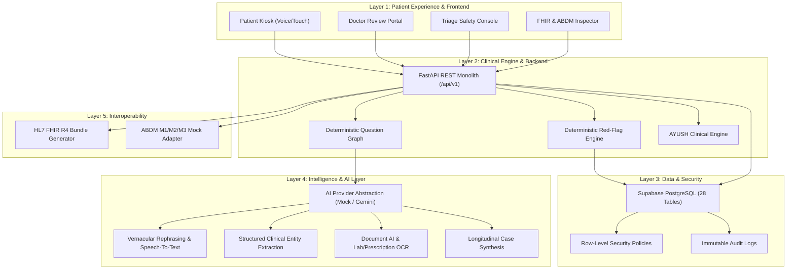
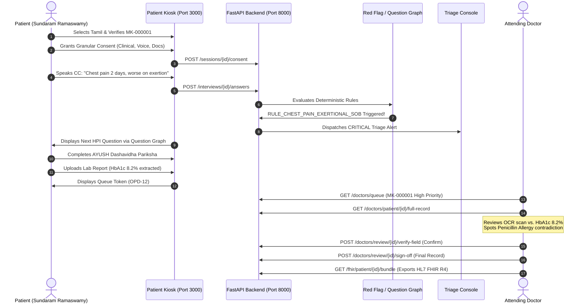

# MediKiosk — Complete System Specification & Architecture Manual

> **Smart India Hackathon 2026 — Problem Statement SIH26047 (Ministry of Ayush Track)**  
> **System Name:** MediKiosk — Pre-Consultation AI-Assisted Patient Case-Taking System  
> **Guiding Axioms:**  
> *"MediKiosk moves clinical history-taking from inside the doctor's 3-minute consultation to before the consultation."*  
> *"AI prepares the case; the doctor owns the clinical decision."*

---

## Table of Contents
1. [Executive Summary & Product Identity](#1-executive-summary--product-identity)
2. [Technology Stack & Languages](#2-technology-stack--languages)
3. [Five-Layer System Architecture](#3-five-layer-system-architecture)
4. [Database & Storage Architecture (Supabase PostgreSQL)](#4-database--storage-architecture-supabase-postgresql)
   - [Enum Types](#enum-types)
   - [28 Normalized Tables & Schemas](#28-normalized-tables--schemas)
   - [Row-Level Security (RLS) Policies](#row-level-security-rls-policies)
   - [Synthetic Demo Seed Data (`MK-000001`)](#synthetic-demo-seed-data-mk-000001)
5. [Backend & Clinical Engine (Python / FastAPI)](#5-backend--clinical-engine-python--fastapi)
   - [Core Architecture & Security](#core-architecture--security)
   - [Deterministic Clinical Question Graph](#deterministic-clinical-question-graph)
   - [Deterministic Safety & Red-Flag Rule Engine](#deterministic-safety--red-flag-rule-engine)
   - [AI Layer & Provider Abstraction (`mock` vs `gemini`)](#ai-layer--provider-abstraction-mock-vs-gemini)
   - [All API Routers & Endpoints Specification](#all-api-routers--endpoints-specification)
6. [Interoperability: HL7 FHIR R4 & ABDM Adapters](#6-interoperability-hl7-fhir-r4--abdm-adapters)
   - [HL7 FHIR R4 Resource Mapping](#hl7-fhir-r4-resource-mapping)
   - [ABDM M1, M2, M3 Mock Adapter](#abdm-m1-m2-m3-mock-adapter)
7. [AYUSH Clinical Engine (Dashavidha Pariksha & Ahara-Vihara)](#7-ayush-clinical-engine-dashavidha-pariksha--ahara-vihara)
8. [Frontend Architecture & Surfaces (Next.js 14+ / React / Tailwind CSS)](#8-frontend-architecture--surfaces-nextjs-14--react--tailwind-css)
   - [Surface Directory & Routing Layout](#surface-directory--routing-layout)
   - [Voice Pipeline & Accessibility (TalkBack / TTS)](#voice-pipeline--accessibility-talkback--tts)
   - [Component Library & Aesthetics](#component-library--aesthetics)
9. [Regulatory, Privacy & Security Guardrails](#9-regulatory-privacy--security-guardrails)
10. [End-to-End Golden Path Demonstration (`MK-000001`)](#10-end-to-end-golden-path-demonstration-mk-000001)
11. [Verification Suite & Health Results](#11-verification-suite--health-results)

---

## 1. Executive Summary & Product Identity

In standard outpatient departments (OPDs) across India, physicians face extreme patient loads, often constraining consultations to 2–3 minutes. Crucial clinical history—onset, progression, aggravating factors, long-term comorbidities, medication adherence, drug allergies, and past lab investigations—is either missed or hastily documented.

**MediKiosk** solves this by shifting clinical intake to the OPD waiting room:
- **Software-Only Kiosk**: Functions on any standard touchscreen laptop, tablet, or kiosk terminal without custom microcontrollers.
- **Multimodal Interaction**: Patients interact via vernacular voice (Tamil, Hindi, English), large-touch buttons, or text.
- **Deterministic Clinical Guidance**: Generative AI **never** controls the diagnostic workflow or clinical path. A deterministic question graph governs *what* is asked, and a deterministic safety rule engine detects red flags. The LLM is strictly constrained to vernacular phrasing and entity extraction.
- **Doctor Verification**: AI prepares an evidence-linked case draft with source and confidence badges; the doctor verifies, edits, rejects, or adds notes, and signs off.

---

## 2. Technology Stack & Languages

| Domain | Technology | Version | Purpose & Rationale |
| :--- | :--- | :--- | :--- |
| **Backend Language** | Python | 3.10+ (Tested 3.14) | High-level clinical logic, data science ecosystem, clean Pydantic schemas. |
| **Backend Framework**| FastAPI | >=0.110.0 | High-performance asynchronous REST API, OpenAPI docs, strict typing. |
| **Database** | PostgreSQL / Supabase | 15+ | Relational schema, Row-Level Security (RLS), JSONB storage, audit logs. |
| **Security / Auth** | Python-Jose & Passlib | Latest | JWT bearer tokens, SHA-256 salted hashing, Role-Based Access Control. |
| **Testing** | Pytest & TestClient | >=8.0.0 | Automated unit, regression, and API integration testing. |
| **Frontend Framework**| Next.js (App Router) | 14.2.5 | React 18, server & client components, static page generation, zero hydration lag. |
| **Frontend Language** | TypeScript | 5.4+ | End-to-end type safety shared with backend schemas. |
| **Styling & Design** | Tailwind CSS | 3.4.1 | Custom design tokens, glassmorphism, kiosk high-contrast accessibility. |
| **Icons** | Lucide-React | Latest | Crisp SVG iconography for clinical workflows. |
| **AI Layer** | Google Gemini & Mock | 1.5/2.0 Flash | Offline mock provider for zero-key execution + Google Gemini API client. |
| **Interoperability** | HL7 FHIR R4 & ABDM | R4 / M1-M3 | Healthcare data exchange standards and national digital health integration. |

---

## 3. Five-Layer System Architecture



---

## 4. Database & Storage Architecture (Supabase PostgreSQL)

### Enum Types
1. `user_role`: `PATIENT`, `DOCTOR`, `TRIAGE_STAFF`, `ADMIN`
2. `identifier_type`: `INTERNAL_MEDIKIOSK_ID`, `ABHA_NUMBER`, `ABHA_ADDRESS`, `HOSPITAL_PATIENT_ID`, `AADHAAR_REFERENCE`
3. `clinical_data_source`: `PATIENT_INTERVIEW`, `DOCTOR_INPUT`, `OCR`, `DOCUMENT_AI`, `PREVIOUS_RECORD`, `AYUSH_INTERVIEW`, `SYSTEM_RULE`
4. `consent_status`: `GRANTED`, `DENIED`, `REVOKED`
5. `consent_category`: `CLINICAL_HISTORY`, `VOICE_PROCESSING`, `MEDICAL_DOCUMENTS`, `DOCTOR_SHARING`, `HIS_SHARING`, `ABDM_SHARING`, `RESEARCH_ANALYTICS`
6. `session_status`: `INITIATED`, `CONSENT_PENDING`, `IN_PROGRESS`, `AWAITING_DOCUMENTS`, `PROCESSING_AI`, `READY_FOR_REVIEW`, `DOCTOR_REVIEWING`, `COMPLETED`, `ABANDONED`
7. `red_flag_severity`: `LOW`, `MODERATE`, `HIGH`, `CRITICAL`
8. `triage_status`: `ACTIVE`, `ACKNOWLEDGED`, `UNDER_REVIEW`, `ESCALATED`, `CLOSED`
9. `verification_action`: `CONFIRMED`, `EDITED`, `REJECTED`, `ADDED`
10. `document_type`: `PRESCRIPTION`, `LAB_REPORT`, `DISCHARGE_SUMMARY`, `IMAGING_REPORT`, `OTHER`

### 28 Normalized Tables & Schemas

| # | Table Name | Key Columns & Types | Description |
| :--- | :--- | :--- | :--- |
| 1 | `users` | `id` UUID PK, `email` VARCHAR, `phone` VARCHAR, `password_hash` VARCHAR, `role` user_role | System authentication accounts. |
| 2 | `patients` | `id` UUID PK, `user_id` UUID FK, `medikiosk_id` VARCHAR UNIQUE, `full_name`, `dob`, `age`, `gender`, `preferred_language` | Core patient demographic registry. |
| 3 | `patient_identifiers`| `id` UUID PK, `patient_id` UUID FK, `identifier_type`, `identifier_value`, `issuing_system`, `verified` | ABHA, Hospital MRN, MediKiosk ID mapping. Raw Aadhaar never used as internal PK. |
| 4 | `patient_access` | `id` UUID PK, `patient_id` UUID FK, `doctor_id` UUID FK, `expires_at`, `is_active` | Time-bound authorization grants between doctor and patient. |
| 5 | `clinical_sessions`| `id` UUID PK, `patient_id` UUID FK, `session_status`, `mode` (STANDARD/AYUSH), `current_step`, `chief_complaint_text` | State of the pre-consultation intake encounter. |
| 6 | `consents` | `id` UUID PK, `patient_id` UUID FK, `session_id` UUID FK, `consent_type`, `status`, `audio_confirmation_recorded` | Granular, auditable, and revocable consent records. |
| 7 | `interviews` | `id` UUID PK, `session_id` UUID FK, `current_node_id`, `is_completed` | Clinical question graph traversal state. |
| 8 | `questions` | `id` VARCHAR PK, `section`, `question_text_en`, `question_text_ta`, `question_text_hi`, `input_type` | Controlled multi-lingual clinical questions bank. |
| 9 | `answers` | `id` UUID PK, `interview_id` UUID FK, `question_id` VARCHAR FK, `raw_answer_text`, `confidence` | Raw patient responses and input modality tags. |
| 10 | `clinical_entities`| `id` UUID PK, `session_id` UUID FK, `entity_type`, `entity_name`, `attributes` JSONB, `source`, `confidence` | Structured extracted clinical facts. |
| 11 | `medical_conditions`| `id` UUID PK, `patient_id` UUID FK, `condition_name`, `icd10_code`, `status`, `source`, `doctor_verified` | Verified chronic or acute medical conditions. |
| 12 | `surgical_history` | `id` UUID PK, `patient_id` UUID FK, `procedure_name`, `approximate_date`, `hospital_name`, `doctor_verified` | Past surgical procedures and outcomes. |
| 13 | `medications` | `id` UUID PK, `patient_id` UUID FK, `drug_name`, `dosage`, `frequency`, `route`, `status`, `doctor_verified` | Active and historical pharmacological regimens. |
| 14 | `allergies` | `id` UUID PK, `patient_id` UUID FK, `allergen`, `reaction_nature`, `severity`, `contradiction_flag`, `doctor_verified` | Hypersensitivity records with contradiction tracking. |
| 15 | `family_history` | `id` UUID PK, `patient_id` UUID FK, `relation`, `condition_name`, `doctor_verified` | Familial predispositions. |
| 16 | `personal_history` | `id` UUID PK, `patient_id` UUID FK, `diet_type`, `sleep_pattern`, `smoking_status`, `alcohol_status` | Lifestyle and social history. |
| 17 | `investigations` | `id` UUID PK, `patient_id` UUID FK, `test_name`, `result_value`, `unit`, `reference_range`, `is_abnormal`, `doctor_verified` | Discrete laboratory tests extracted from reports. |
| 18 | `documents` | `id` UUID PK, `patient_id` UUID FK, `document_type`, `file_name`, `ocr_raw_text`, `ocr_status`, `has_handwriting` | Uploaded prescription and report file metadata. |
| 19 | `document_entities`| `id` UUID PK, `document_id` UUID FK, `entity_type`, `entity_key`, `entity_value`, `confidence` | Discrete entities parsed from uploaded documents. |
| 20 | `medical_timeline` | `id` UUID PK, `patient_id` UUID FK, `event_date`, `event_type`, `title`, `description`, `source`, `confidence` | Unified chronological stream of patient events. |
| 21 | `ayush_assessments`| `id` UUID PK, `session_id` UUID FK, `prakriti` JSONB, `vikriti` JSONB, `sara`, `samhanana`, `ahara_shakti` JSONB, `ahara_vihara` JSONB | Discrete Dashavidha Pariksha & Ahara-Vihara parameters. |
| 22 | `red_flags` | `id` UUID PK, `session_id` UUID FK, `rule_id`, `severity`, `title`, `clinical_recommendation`, `is_active` | Deterministic safety warnings for triage. |
| 23 | `triage_alerts` | `id` UUID PK, `red_flag_id` UUID FK, `status`, `action_taken`, `acknowledged_by` UUID FK | Operational hospital triage workstation queue. |
| 24 | `summaries` | `id` UUID PK, `session_id` UUID FK, `chief_complaint_summary`, `hpi_summary`, `evidence_links` JSONB, `is_finalized` | Evidence-linked longitudinal case synthesis. |
| 25 | `summary_sections` | `id` UUID PK, `summary_id` UUID FK, `section_name`, `section_content`, `evidence_count` | Granular sections of the clinical synthesis. |
| 26 | `doctor_reviews` | `id` UUID PK, `session_id` UUID FK, `doctor_id` UUID FK, `field_verifications` JSONB, `clinical_notes`, `is_signed_off` | Doctor audit record with timestamped sign-off. |
| 27 | `audit_logs` | `id` UUID PK, `user_id` UUID FK, `action_type`, `resource_accessed`, `ip_address`, `metadata` JSONB | Append-only tamper-evident security audit trail. |
| 28 | `fhir_exports` | `id` UUID PK, `patient_id` UUID FK, `bundle_json` JSONB, `fhir_version` | Exported HL7 FHIR R4 compliant records. |

### Row-Level Security (RLS) Policies
- **Patients**: Can only select and update rows matching their own `auth_user_id()`.
- **Doctors**: Can only access patient clinical rows if an active record exists in `patient_access` with an unexpired timestamp.
- **Triage Staff**: Granted select and update access strictly on `red_flags` and `triage_alerts`.
- **Audit Logs**: Strictly append-only (`INSERT` permitted for all system actors; `UPDATE` and `DELETE` disallowed; select restricted to `ADMIN`).

### Synthetic Demo Seed Data (`MK-000001`)
- **Patient**: Sundaram Ramaswamy, 52-year-old male, Tamil speaker.
- **Internal ID**: `MK-000001`, ABHA: `91-4521-8890-1234`, Hospital MRN: `GMC-OPD-9042`.
- **Historical Baseline**: Type 2 Diabetes Mellitus (2018), Essential Hypertension (2020), Metformin 500mg BD, Amlodipine 5mg OD.
- **Contradiction Case**: Hospital record (2019) documents severe Penicillin allergy (urticaria). During verbal intake, patient states *"no allergies"*. System flags: *"ALLERGY CONTRADICTION: Prior medical record notes Penicillin allergy — physician verification required."*
- **Acute Chief Complaint**: Retrosternal chest tightness and shortness of breath for past 2 days, provoked by exertion, relieved by rest.
- **OCR Lab Document**: Uploaded report extracts HbA1c 8.2% (suboptimal glycemic control) with 97% confidence.
- **Red Flag Trigger**: Rule `RULE_CHEST_PAIN_EXERTIONAL_SOB` fires `CRITICAL` alert: *"Priority clinical assessment recommended. Immediate 12-lead ECG and physician evaluation advised."*

---

## 5. Backend & Clinical Engine (Python / FastAPI)

### Core Architecture & Security
- **Path**: `backend/app/`
- **Application Entry**: `main.py` initializes FastAPI, mounts CORS middleware, registers all `/api/v1` routers, and configures health checks.
- **Database Access Layer**: `core/database.py` provides unified access. When `SUPABASE_URL` is empty, it transparently operates on an in-memory repository initialized with `MK-000001` seed data, allowing zero-key local execution.
- **Security & RBAC**: `core/security.py` validates JWT tokens, implements password verification, and enforces role guardrails (`require_roles(['DOCTOR'])`).

### Deterministic Clinical Question Graph
Located in `app/clinical/question_graph.py` and `app/clinical/graph_definitions.json`:
- Controls question sequencing: `Chief Complaint` → `HPI Duration` → `Onset` → `Location` → `Severity (1-10)` → `Character` → `Aggravating Factors` → `Relieving Factors` → `Associated Symptoms` → `Past Medical History` → `Medications` → `Allergies` → `Review of Systems`.
- Language selection (`en`, `ta`, `hi`) delivers clinically validated translations without altering the underlying clinical node graph.

### Deterministic Safety & Red-Flag Rule Engine
Located in `app/safety/red_flag_engine.py`:
- **Rule 1 (`RULE_CHEST_PAIN_EXERTIONAL_SOB`)**: Triggered when chest pain/tightness keywords coincide with dyspnea or exertional triggers. Produces `CRITICAL` severity alert and automatically dispatches to the Triage Desk.
- **Rule 2 (`RULE_SEVERE_ACUTE_PAIN`)**: Triggered on pain scale answers `>= 8/10`. Severity: `HIGH`.
- **Rule 3 (`RULE_SYNCOPE_EPISODE`)**: Triggered on loss of consciousness or fainting. Severity: `CRITICAL`.
- **Constraint**: Recommendation text always reads *"Priority clinical assessment recommended"*, never diagnosing pathology (e.g. never *"you are having a myocardial infarction"*).

### AI Layer & Provider Abstraction (`mock` vs `gemini`)
- **Abstract Interface**: `app/ai/base.py` defines `rephrase_question`, `extract_clinical_entities`, `process_document_ocr`, and `generate_longitudinal_summary`.
- **Mock Provider (`app/ai/mock_provider.py`)**: Standalone offline provider executing regex and entity extraction for medications, conditions, allergies, and lab tests; synthesizes evidence-linked summaries with zero external network calls.
- **Gemini Provider (`app/ai/gemini_provider.py`)**: Connects to Google Gemini 1.5/2.0 Flash when `GEMINI_API_KEY` is provided; automatically falls back to the mock provider upon network error or quota exhaustion.
- **Dedicated Services**:
  - `conversation_service.py`: Natural language question phrasing.
  - `extraction_service.py`: Structured Pydantic extraction.
  - `document_ai_service.py`: Prescription and lab OCR parsing.
  - `summary_service.py`: Longitudinal evidence synthesis.

### All API Routers & Endpoints Specification

| Router | Method & Endpoint | Request Body | Response & Description |
| :--- | :--- | :--- | :--- |
| **Auth** | `POST /api/v1/auth/login` | `LoginRequest` (identifier, password) | Returns JWT Bearer token and user profile. |
| **Auth** | `POST /api/v1/auth/otp/send` | `OTPRequest` (phone) | Dispatches mock SMS OTP (Demo: `123456`). |
| **Auth** | `POST /api/v1/auth/otp/verify` | `OTPVerifyRequest` (phone, otp_code) | Validates OTP and issues JWT token. |
| **Auth** | `GET /api/v1/auth/me` | None (Bearer Header) | Returns authenticated user token claims. |
| **Patients** | `GET /api/v1/patients/{id}` | None | Returns demographic profile and linked external identifiers. |
| **Patients** | `POST /api/v1/patients` | `PatientCreate` | Registers new patient; generates next `MK-XXXXXX` ID. |
| **Sessions** | `POST /api/v1/sessions` | `SessionCreate` (patient_id, mode, lang) | Initiates intake session in `CONSENT_PENDING` status. |
| **Sessions** | `GET /api/v1/sessions/{id}` | None | Returns session state and progress. |
| **Sessions** | `POST /api/v1/sessions/{id}/consent` | `ConsentSubmission` (consents array, lang) | Records multi-category consent and advances session to `CHIEF_COMPLAINT`. |
| **Interviews**| `GET /api/v1/interviews/{session_id}/next-question` | None | Evaluates graph state; returns next multi-lingual question. |
| **Interviews**| `POST /api/v1/interviews/{session_id}/answers` | `AnswerSubmission` (question_id, answer, modality) | Persists answer, extracts entities, and triggers red-flag rules. |
| **Documents**| `GET /api/v1/documents/patient/{patient_id}` | None | Lists uploaded documents for patient. |
| **Documents**| `POST /api/v1/documents/upload` | Multipart form (file, doc_type, patient_id) | Simulates/executes OCR; extracts lab tests and normal ranges. |
| **Timeline** | `GET /api/v1/timeline/{patient_id}` | None | Chronological unified medical timeline (diagnoses, meds, labs). |
| **Red Flags**| `GET /api/v1/red-flags/session/{session_id}` | None | Returns active safety flags for the clinical session. |
| **Triage** | `GET /api/v1/triage/alerts` | Query: `status_filter` | Live alert feed for hospital triage desk. |
| **Triage** | `POST /api/v1/triage/alerts/{id}/action` | `TriageActionRequest` (status, action_taken) | Acknowledges, escalates, or closes triage alerts. |
| **AYUSH** | `GET /api/v1/ayush/{session_id}` | None | Returns structured Dashavidha Pariksha & Ahara-Vihara parameters. |
| **AYUSH** | `POST /api/v1/ayush/{session_id}` | JSON payload of parameters | Updates discrete AYUSH clinical parameters. |
| **Summaries**| `GET /api/v1/summaries/{session_id}` | None | Synthesizes longitudinal case summary with evidence links. |
| **Doctors** | `GET /api/v1/doctors/queue` | None | Returns physician queue sorted by triage priority and wait time. |
| **Doctors** | `GET /api/v1/doctors/patient/{patient_id}/full-record` | None | Consolidates all history, original documents, timeline, and summary. |
| **Doctors** | `POST /api/v1/doctors/review/{session_id}/verify-field` | `FieldVerificationRequest` (field_id, action) | Field verification: `CONFIRMED`, `EDITED`, `REJECTED`. |
| **Doctors** | `POST /api/v1/doctors/review/{session_id}/sign-off` | `SignOffRequest` (clinical_notes, plan) | Finalizes encounter, generates immutable record, triggers audit log. |
| **FHIR** | `GET /api/v1/fhir/patient/{patient_id}/bundle` | None | Exports doctor-verified encounter as HL7 FHIR R4 Bundle JSON. |
| **ABDM** | `POST /api/v1/abdm/verify-abha` | `AbhaVerifyRequest` (abha_id) | Simulates ABDM M1 ABHA Verification. |
| **ABDM** | `POST /api/v1/abdm/consent/request` | `AbdmConsentRequest` | Simulates ABDM M2 Consent Artifact Generation. |
| **ABDM** | `GET /api/v1/abdm/records/fetch/{id}` | None | Simulates ABDM M3 Health Data Exchange via HIP/HIU gateway. |
| **Audit** | `GET /api/v1/audit/patient/{patient_id}` | None | Returns immutable access and verification audit trail. |

---

## 6. Interoperability: HL7 FHIR R4 & ABDM Adapters

### HL7 FHIR R4 Resource Mapping
Implemented in `backend/app/integrations/fhir_adapter.py`. When a physician signs off on a case, the system exports a standard FHIR Document Bundle (`"resourceType": "Bundle"`, `"type": "document"`) containing:
1. **`Patient`**: Official identifier (`MK-000001`), demographics, gender, phone.
2. **`Encounter`**: Status `finished`, class `AMB` (ambulatory), chief complaint reason.
3. **`Condition`**: ICD-10 coded problems (e.g. `E11.9` for Type 2 Diabetes, `I10` for Essential Hypertension).
4. **`MedicationStatement`**: Active drugs (Metformin 500mg BD, Amlodipine 5mg OD) with dosage instructions.
5. **`AllergyIntolerance`**: Allergen (Penicillin), severity, and verification status (`confirmed`).
6. **`Observation`**: Discrete laboratory results (HbA1c 8.2%, Serum Creatinine 1.0 mg/dL) with normal reference ranges and high-risk interpretation codes.

### ABDM M1, M2, M3 Mock Adapter
Implemented in `backend/app/integrations/abdm_adapter.py`:
- **Milestone 1 (M1)**: Verifies ABHA number (`91-4521-8890-1234`) and address (`sundaram.ramaswamy@abdm`) against the sandbox directory.
- **Milestone 2 (M2)**: Issues electronic consent requests (`CAREATND` purpose code) with validity timestamps and defined Health Information Types (`Prescription`, `DiagnosticReport`, `OPConsultation`).
- **Milestone 3 (M3)**: Simulates health data discovery and fetch from Health Information Providers (HIPs), returning historical consultation records and previous lab tests.

---

## 7. AYUSH Clinical Engine (Dashavidha Pariksha & Ahara-Vihara)

Problem statement **SIH26047** requires systematic capture of traditional Ayurvedic diagnostic parameters. MediKiosk stores all parameters as discrete, queryable attributes:

```
                                  AYUSH ASSESSMENT
                                         │
                 ┌───────────────────────┴───────────────────────┐
                 │                                               │
        DASHAVIDHA PARIKSHA                                AHARA-VIHARA
                 │                                               │
   ┌─────────────┼─────────────┐                   ┌─────────────┴─────────────┐
   │             │             │                   │                           │
Prakriti      Vikriti      Ahara Shakti          Ahara                       Vihara
(Pitta-Kapha) (Vata-Pitta) (Jarana Avara)   (Warm, cooked food)         (Disturbed sleep)
```

1. **Prakriti**: Baseline constitutional phenotype stored as percentage dosha scores (`vata_score`, `pitta_score`, `kapha_score`) and primary dosha (`Pitta-Kapha`).
2. **Vikriti**: Present doshic disturbance (`Prana Vata / Sadhaka Pitta disturbance indicated by chest heaviness`).
3. **Sara**: Tissue vitality rating (`Pravara`, `Madhyama`, `Avara`).
4. **Samhanana**: Body compactness and symmetry (neutral clinical language).
5. **Pramana**: Anthropometric measures (Height: 168 cm, Weight: 74 kg, BMI: 26.2).
6. **Satmya**: Habituation and dietetic adaptability (Habituated to South Indian vegetarian diet).
7. **Sattva**: Mental endurance (`Madhyama`).
8. **Ahara Shakti**: Divided into `Abhyavaharana Shakti` (appetite: Madhyama) and `Jarana Shakti` (digestion: Avara / sluggish).
9. **Vyayama Shakti**: Work capacity and stamina (`Avara` due to exertional dyspnea).
10. **Vaya**: Biological age group derived from date of birth (`Madhyama` / Adult).
11. **Ahara-Vihara**: Discrete lifestyle habits covering meal timings, sleep quality (disturbed past 2 nights), water intake (2.0 L), and daily exercise.

---

## 8. Frontend Architecture & Surfaces (Next.js 14+ / React / Tailwind CSS)

### Surface Directory & Routing Layout
```
frontend/src/app/
├── layout.tsx             # Root layout with accessibility providers & compliance footer
├── globals.css            # Custom CSS tokens, glassmorphic panels, voice pulse animations
├── page.tsx               # Kiosk landing portal & golden path quick-launcher
├── login/page.tsx         # Multi-role authentication & mock OTP tab
├── kiosk/page.tsx         # Interactive multi-step patient intake journey
├── doctor/page.tsx        # Physician queue, evidence review, verification & FHIR export
├── triage/page.tsx        # Urgent safety red-flag workstation
└── integrations/page.tsx  # Interactive FHIR R4 JSON & ABDM M1-M3 test bench
```

### Voice Pipeline & Accessibility (TalkBack / TTS)
- **Voice Recognition**: Web Speech API (`webkitSpeechRecognition`) integrated with fallback simulation for environments without microphone access.
- **Speech Synthesis (TTS)**: Reads clinical questions aloud in vernacular Tamil, Hindi, or English.
- **Audio Assistance (TalkBack)**: Header button toggles audio help for vision-impaired or elderly patients.
- **Kiosk Touch Ergonomics**: Minimum touch target size of 48px, high-contrast text, clear progress indicators, and touch fallbacks for every voice step.

### Component Library & Aesthetics
- **Color Palette**: Deep slate background (`#0b0f19`), clinical teal/sky (`#0ea5e9`), emerald verification (`#10b981`), critical red-flag alert (`#ef4444`), and warm AYUSH gold (`#b3862b`).
- **Glassmorphism**: Backdrop blur with subtle borders (`glass-panel`, `glass-card`, `glass-panel-gold`).
- **Micro-Animations**: Animated voice pulse (`animate-voice-pulse`) active while listening; priority red-flag alert pulse.

---

## 9. Regulatory, Privacy & Security Guardrails

### Mandatory Compliance Disclaimer
> *"Designed with privacy-by-design principles and intended to align with applicable Indian data protection, ABDM consent, and healthcare security requirements. Production deployment requires formal security and compliance validation."*

### Explicit Hard Boundaries
1. **AI Never Diagnoses or Prescribes**: System recommendations are strictly labelled *"Priority clinical assessment recommended"*, never naming conditions as definitive diagnoses.
2. **Deterministic Control**: The LLM is strictly prohibited from altering clinical question sequence or making triage decisions unsupervised.
3. **No External Identifiers as Primary Keys**: Internal IDs strictly follow `MK-000001`. ABHA numbers and Hospital MRNs are stored in isolated `patient_identifiers` registries. Raw Aadhaar is never used as an internal key.
4. **Contradictions Surface, Never Overwrite**: If historical records show a Penicillin allergy and the patient states no allergies, the system flags the contradiction with high visibility for the doctor rather than auto-correcting.
5. **No Medical Data in Client Storage or URLs**: Authentication tokens are stored with short expiry; patient health data is fetched only over authenticated TLS-ready API calls.

---

## 10. End-to-End Golden Path Demonstration (`MK-000001`)



---

## 11. Verification Suite & Health Results

### 1. Automated Backend Test Suite (Pytest)
Command: `python -m pytest tests/ -v`  
Result: **16/16 tests passing (100%)**

- `test_api_endpoints.py::test_auth_login` — **PASSED**
- `test_api_endpoints.py::test_get_patient` — **PASSED**
- `test_api_endpoints.py::test_interview_next_question` — **PASSED**
- `test_api_endpoints.py::test_doctor_queue` — **PASSED**
- `test_api_endpoints.py::test_triage_alerts` — **PASSED**
- `test_api_endpoints.py::test_ayush_assessment` — **PASSED**
- `test_api_endpoints.py::test_fhir_bundle_endpoint` — **PASSED**
- `test_api_endpoints.py::test_abdm_verify_abha` — **PASSED**
- `test_clinical_graph.py::test_question_graph_first_question` — **PASSED**
- `test_clinical_graph.py::test_question_graph_tamil_language` — **PASSED**
- `test_clinical_graph.py::test_question_graph_traversal` — **PASSED**
- `test_clinical_graph.py::test_question_graph_ayush_nodes` — **PASSED**
- `test_fhir_export.py::test_fhir_bundle_export` — **PASSED**
- `test_health.py::test_health_check` — **PASSED**
- `test_red_flags.py::test_chest_pain_and_dyspnea_trigger` — **PASSED**
- `test_red_flags.py::test_no_red_flag_for_mild_symptoms` — **PASSED**

### 2. Frontend Production Compilation
Command: `npm run build` in `frontend/`  
Result: **Exit code 0 (100% typecheck and build pass)**
- All routes compiled cleanly: `/`, `/kiosk`, `/doctor`, `/triage`, `/integrations`, `/login`.

### 3. Server Endpoints Status
- **Backend**: `http://127.0.0.1:8000/api/v1/health` → `HTTP 200 OK`
- **Frontend**: `http://127.0.0.1:3000/` → `HTTP 200 OK`
